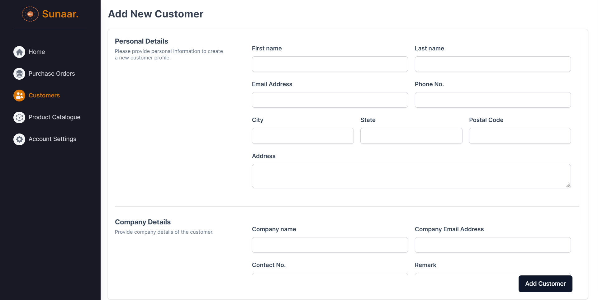

# Sunaar Frontend

Dashboard

#### Features:

- [x] Key **Business metrics** of Sales, Order and Customer records
- [x] **Real-time prices** of Gold and Silver Commodities 
- [x] Bar graph for tracking **Income vs Expense** along with time period filters
- [x] Pie Chart for representing **Sales** and **Customer Distribution** in various states 
- [x] An overview about **Top customers** and **Recent Orders** in the system 

#### Screenshots:

<!--  -->

Customers

#### Features:

- [x] Customer Records
  - Essential **customer details** with the option of downloading the data in **CSV** format
  - **Searching** feature implemented with **Debouncing**
  - **Server-Side Pagination** for faster data retriveal
  - Click on the `Next` and `Previous` buttons to navigate to the next and previous pages  
  - `Copy ID` button copies the unique ID of a specific customer to the clipboard
  - `View Details` button navigates dedicated page displaying comprehensive details about the selected customer
- [x] View Customer Details
  - **Detailed information** about the customer and the company.
  - **Order history** providing insights into the customer's purchase activities
- [x] Create Customer
  - User-friendly **form with validations** to seamlessly **add** a **customer** to the system
  - Takes input as the customer personal details as well as the company details
- [x] Intuitive design with **alert messages** and feedback, ensuring a smooth UI/UX
  
#### Screenshot:

Orders

#### Features:

- [x] Purchase Order Records
  - Listing of Purchase Orders sorted by date.
  - The table shows important details like **Company Name, Order weight** & **Value, Order status** etc.
  - **Searching** feature implemented with **Debouncing**
  - **Server-Side Pagination** for faster data retriveal
  - Click on the `Next` and `Previous` buttons to navigate to the next and previous pages  
  - `Copy ID` button copies the unique ID of a specific order to the clipboard
  - `View Details` button navigates dedicated page displaying comprehensive details about the selected order
- [x] View Order Details
  - **Detailed information** about the order and the products.
  - `View Customer` button to see details about the customer who placed the order
  - `Download Icon` allows to download the Order Invoice in a PDF format
- [x] Update Order Status
  - `Update Status` button opens a modal designed for efficiently updating the order status from Active to relevant status
- [x] Create Purchase Order
  - Input customer ID and company; backend fetches other details
  - **Add products** by specifying Product ID and quantity
  - Intuitively designed cart with the option to add & remove items using the `Plus Icon` & `Cross Icon`
  - Real-time display of calculated **order weight** (in grams) and **value** (in Rs) at the bottom
  - Finalize order creation by clicking the `Create Order` button
- [x] Intuitive design with **alert messages** and feedback, ensuring a smooth UI/UX
  
#### Screenshot:

Products

 

#### Features:

- [x] Product Listing
  - The Products are  presented in an organized masonry grid pattern for efficient viewing
  - Hovering over a product reveals additional details such as Product ID, Category, and Weight
  - Clicking on a product copies its unique ID to the clipboard
  - The interface includes a category-based search option for seamless exploration.

#### Screenshots:

Account Settings

 

#### Features:

- [x] Update Personal Details form
- [x] Update Password Form
- [x] Help section to know more about the system
#### Screenshots:

